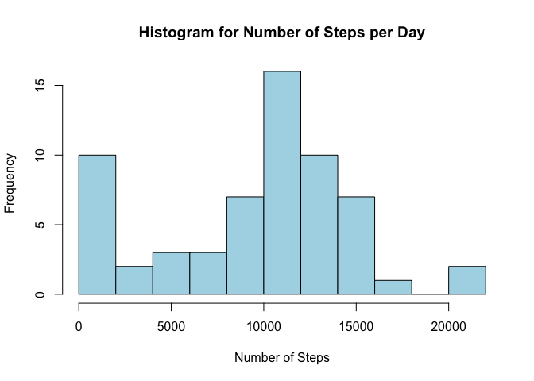
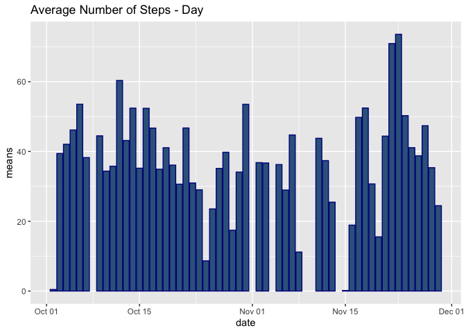
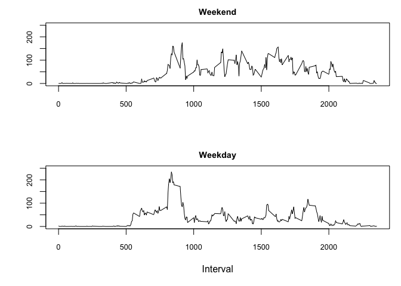

## Loading and preprocessing the data
### load libraries

```r
library(tidyverse)
```

```
## ── Attaching packages ────────────────────────────────────────────────────────────────────────────── tidyverse 1.2.1 ──
```

```
## ✔ ggplot2 3.2.1     ✔ purrr   0.3.2
## ✔ tibble  2.1.3     ✔ dplyr   0.8.3
## ✔ tidyr   1.0.0     ✔ stringr 1.4.0
## ✔ readr   1.3.1     ✔ forcats 0.4.0
```

```
## ── Conflicts ───────────────────────────────────────────────────────────────────────────────── tidyverse_conflicts() ──
## ✖ dplyr::filter() masks stats::filter()
## ✖ dplyr::lag()    masks stats::lag()
```

```r
library(dplyr)
library(gridExtra)
```

```
## 
## Attaching package: 'gridExtra'
```

```
## The following object is masked from 'package:dplyr':
## 
##     combine
```

Read CSV datafiles & convert date strings to dates 

```r
PAdata <- read.csv("activity.csv", stringsAsFactors = FALSE)
PAdata$date <- as.Date(PAdata$date, "%Y-%m-%d")
summary(PAdata)
```

```
##      steps             date               interval     
##  Min.   :  0.00   Min.   :2012-10-01   Min.   :   0.0  
##  1st Qu.:  0.00   1st Qu.:2012-10-16   1st Qu.: 588.8  
##  Median :  0.00   Median :2012-10-31   Median :1177.5  
##  Mean   : 37.38   Mean   :2012-10-31   Mean   :1177.5  
##  3rd Qu.: 12.00   3rd Qu.:2012-11-15   3rd Qu.:1766.2  
##  Max.   :806.00   Max.   :2012-11-30   Max.   :2355.0  
##  NA's   :2304
```

Group by date & summarize

```r
PAdata_bg <- group_by(PAdata, date)
PAdata_summary <- summarize(PAdata_bg, totalSteps=sum(steps, na.rm=TRUE))
```

## What is mean total number of steps taken per day?
### plot histogram

```r
hist(PAdata_summary$totalSteps, 
     xlab="Number of Steps", 
     main="Histogram for Number of Steps per Day",
     breaks=15, col="lightblue")
```

<!-- -->

### Summarize data grouped by date to get mean and median

```r
s1 <- summarize(PAdata_bg, mean(steps, na.rm=TRUE), median(steps, na.rm=TRUE))
names(s1) <- c("date", "means", "medians")
print(s1)
```

```
## # A tibble: 61 x 3
##    date         means medians
##    <date>       <dbl>   <dbl>
##  1 2012-10-01 NaN          NA
##  2 2012-10-02   0.438       0
##  3 2012-10-03  39.4         0
##  4 2012-10-04  42.1         0
##  5 2012-10-05  46.2         0
##  6 2012-10-06  53.5         0
##  7 2012-10-07  38.2         0
##  8 2012-10-08 NaN          NA
##  9 2012-10-09  44.5         0
## 10 2012-10-10  34.4         0
## # … with 51 more rows
```

## What is the average daily activity pattern?
### Plot time series of averages

```r
p2 <- ggplot(s1, aes(x=date, y=means, na.rm=TRUE )) + 
  geom_bar(stat="identity", color="dark blue", fill="steelblue4") +
  ggtitle("Average Number of Steps - Day  ")
print(p2)
```

```
## Warning: Removed 8 rows containing missing values (position_stack).
```

<!-- -->


## Imputing missing values
### impute for NA values

```r
totalNA <- sum(complete.cases(PAdata))
print(totalNA)
```

```
## [1] 15264
```

Substitute NAs with value - means from same interval

```r
averageSteps <- aggregate(steps ~ interval, PAdata, FUN=mean)
newSet <- numeric()
for (i in 1:nrow(PAdata)) {
  if(is.na(PAdata[i,]$steps)) {
    steps <- subset(averageSteps, interval == PAdata[i,]$interval)$steps
  }
  else
  {
    steps <- PAdata[i,]$steps
  }
  newSet <- c(newSet, steps)
}
```

Create new dataset with NAs substituted

```r
PAdata_new <- PAdata
PAdata_new$steps <- newSet
```


## Are there differences in activity patterns between weekdays and weekends?

### Panel Graph for weekday and weekend average steps by Interval

```r
PAdata_int <- PAdata %>% mutate(DayType=ifelse(weekdays(date)=="Saturday" |
                                                 weekdays(date)=="Sunday",'Weekend','Weekday'))
PAdata_summ <- PAdata_int %>% 
  group_by(interval, DayType) %>% 
  summarize(AverageSteps=mean(steps, na.rm=TRUE))
par(mai=c(1,0.8,0.4,0.2), mfrow=c(2,1))

with(filter(PAdata_summ, DayType=='Weekend'), 
     plot(x=interval, y=AverageSteps, type="l", main="Weekend", ylab="", 
          cex.main=0.9, xlab="", cex.axis=0.8, ylim=c(0,250)))
with(filter(PAdata_summ, DayType=='Weekday'), 
     plot(x=interval, y=AverageSteps, type="l", main="Weekday", ylab="", 
          cex.main=0.9, xlab="Interval", cex.axis=0.8, ylim=c(0,250)))
```

<!-- -->

